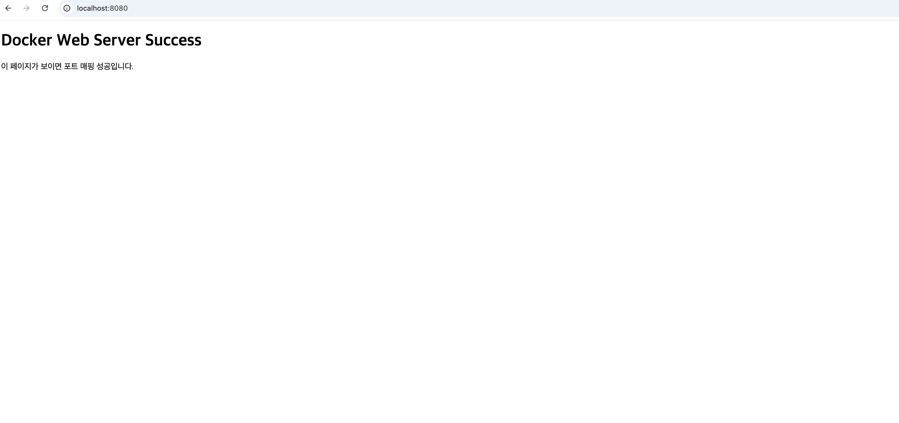
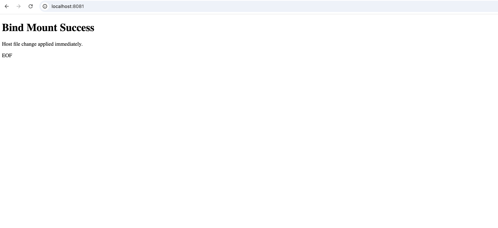
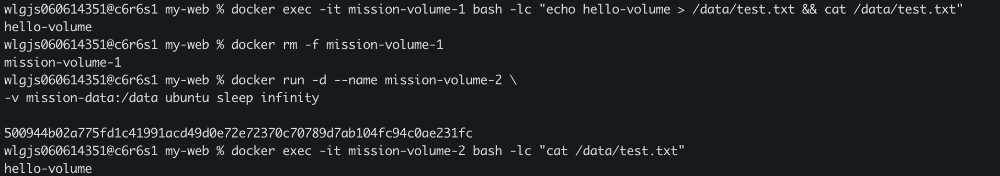

# AI/SW 개발 워크스테이션 구축

---

## 1. 프로젝트 개요

본 프로젝트는 터미널, Docker, Git을 활용하여
재현 가능한 개발 환경을 구축하는 것을 목표로 한다.

개발 환경은 특정 개인 PC에 종속되지 않고,
누구나 동일한 방식으로 실행·배포·검증할 수 있어야 한다.

이를 위해 다음을 수행하였다:

* 터미널 기반 파일 및 권한 관리
* Docker 컨테이너 실행 및 관리
* Dockerfile 기반 커스텀 이미지 제작
* 포트 매핑, 바인드 마운트, 볼륨을 통한 실행 구조 검증
* Git을 통한 버전 관리 및 GitHub 연동

---

## 2. 실행 환경

* OS: macOS (OrbStack)
* Shell: zsh
* Docker: 28.5.2
* Git: 2.53.0

---

## 3. 수행 체크리스트

* [x] 터미널 기본 조작
* [x] 파일 권한 실습
* [x] Docker 설치 및 점검
* [x] hello-world 실행
* [x] Ubuntu 컨테이너 실행
* [x] Dockerfile 기반 이미지 빌드
* [x] 포트 매핑 접속 확인
* [x] 바인드 마운트 검증
* [x] Docker 볼륨 영속성 검증
* [x] Git 설정
* [x] GitHub 연동

---

## 4. 터미널 조작 로그

```bash
$ cd ~/Desktop/Building_AI\&SW_Development_Workstations
$ mkdir practice
$ cd practice

$ touch file.txt
$ echo "hello" > file.txt
$ cat file.txt

$ cp file.txt copy.txt
$ mv copy.txt moved.txt
$ rm moved.txt
```

---

## 5. 파일 권한 실습

```bash
$ ls -l file.txt
$ chmod 644 file.txt
$ chmod 755 .
$ ls -la
```

### 권한 개념

* r: 읽기 / w: 쓰기 / x: 실행
* 644 = rw- r-- r--
* 755 = rwx r-x r-x

---

## 6. Docker 설치 및 점검

```bash
$ docker --version
$ docker info
```

---

## 7. Docker 운영 명령

```bash
$ docker images
$ docker ps
$ docker ps -a
$ docker stats --no-stream
```

```text
CONTAINER ID   IMAGE             STATUS
500944b02a77   ubuntu            Up
d24b945cc3c6   nginx:alpine      Up
e346f1aa3bb3   mission-web:1.0   Up
ad4dc53b48b3   ubuntu            Exited
a594660d9f0a   hello-world       Exited
```

---

## 8. hello-world 실행

```bash
$ docker run hello-world
```

```text
Hello from Docker!
```

---

## 9. Ubuntu 컨테이너 실행

```bash
$ docker run -it ubuntu bash
# echo "inside container"
# exit
```

---

## 10. Dockerfile 기반 웹 서버 구축

### Dockerfile

```dockerfile
FROM nginx:alpine
LABEL org.opencontainers.image.title="mission-web"
ENV APP_ENV=dev
COPY ./app /usr/share/nginx/html
```

### 커스텀 포인트

* nginx:alpine 기반 경량 웹 서버 환경 사용
* LABEL을 통한 이미지 메타데이터 정의
* ENV를 통한 환경 변수 설정
* COPY를 통해 정적 웹 파일을 서버 경로에 복사

---

### 빌드 및 실행

```bash
$ docker build -t mission-web:1.0 .
$ docker run -d -p 8080:80 --name mission-web-8080 mission-web:1.0
$ curl http://localhost:8080
```

---

## 11. 포트 매핑 검증

```bash
$ curl http://localhost:8080
```

브라우저 접속: http://localhost:8080

포트 매핑은 컨테이너 내부 서비스에 외부에서 접근하기 위해 필요하며,
호스트 포트와 컨테이너 포트를 연결하여 웹 서버에 접근할 수 있도록 한다.



---

## 12. 바인드 마운트 검증

```bash
$ docker run -d -p 8081:80 --name mission-bind-8081 \
-v "/Users/wlgjs060614351/Desktop/Building_AI&SW_Development_Workstations/my-web/app:/usr/share/nginx/html" \
nginx:alpine
```

```bash
$ curl http://localhost:8081
```

파일 수정 후:

```bash
$ curl http://localhost:8081
```

바인드 마운트는 호스트 파일 시스템과 컨테이너를 직접 연결하여
파일 변경이 즉시 반영되도록 한다.



---

## 13. Docker 볼륨 영속성 검증

```bash
$ docker volume create mission-data

$ docker exec -it mission-volume-1 bash -lc "echo hello-volume > /data/test.txt && cat /data/test.txt"
hello-volume

$ docker rm -f mission-volume-1

$ docker run -d --name mission-volume-2 \
-v mission-data:/data ubuntu sleep infinity

$ docker exec -it mission-volume-2 bash -lc "cat /data/test.txt"
hello-volume
```

컨테이너 삭제 후에도 데이터가 유지됨을 확인하였다.



---

## 14. Docker 로그 확인

```bash
$ docker logs mission-web-8080
```

```text
nginx/1.29.7
start worker processes
GET / HTTP/1.1 200
GET /favicon.ico 404
```

웹 요청이 정상적으로 처리되고 로그가 기록됨을 확인하였다.

---

## 15. 경로 개념

* 절대 경로: /Users/...
* 상대 경로: ./app

Docker에서는 경로를 명확하게 지정하기 위해 절대 경로 사용이 안정적이다.

---

## 16. 검증 방법

| 항목        | 검증 방법               |
| --------- | ------------------- |
| Docker 동작 | hello-world 실행      |
| 웹 서버      | curl localhost:8080 |
| 포트 매핑     | 브라우저 접속             |
| 바인드 마운트   | 파일 수정 즉시 반영         |
| 볼륨        | 컨테이너 삭제 후 데이터 유지    |

---

## 17. 트러블슈팅

### 1. Dockerfile not found

* 원인: 잘못된 디렉토리에서 build 실행
* 해결: my-web 디렉토리에서 실행

---

### 2. invalid mode 오류

* 원인: 경로에 ":" 포함
* 해결: 폴더명 변경

---

### 3. 줄바꿈 오류

* 원인: "" 뒤 공백
* 해결: 명령어 줄바꿈 수정

---

## 18. Git 설정 및 GitHub 연동

```bash
$ git config --global user.name "이지헌"
$ git config --global user.email "wlgjs06061@naver.com"
$ git config --list
```

```text
user.name=이지헌
user.email=wlgjs0***@naver.com
```

Git은 로컬 버전 관리 도구이며, GitHub는 원격 협업 플랫폼이다.

---

## 19. 결론

* Docker를 통해 실행 환경을 표준화할 수 있다
* 바인드 마운트와 볼륨을 통해 데이터 관리 방식을 이해하였다
* 재현 가능한 환경이 협업의 핵심이다
